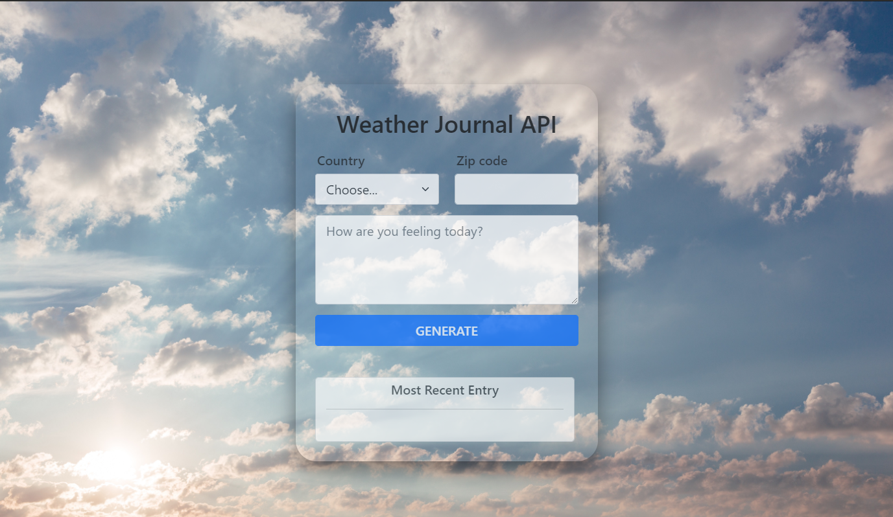

# Weather Journal App

### Introduction

Weather-Journal-App is an Asynchronous web application that uses [OpenWeatherAPI](https://openweathermap.org/) to get the current weather of a location using ZIP code and its corresponding country

### Overview


### Tech stack
* HTML, CSS, Bootstrap 5, Javascript-express 

### Main files
```
.
├── node_modules/
├── package-lock.json
├── package.json
├── server.js
└── website/
    ├── app.js
    ├── index.html
    ├── styles.css
    └── assets/
        ├── csvfiles/
        └── imgs/
```
### Setup
Run the following command to install all required modules
```
npm install
```
then to run it use
```
npm run start
```

Server will be running on `http://localhost:3000`